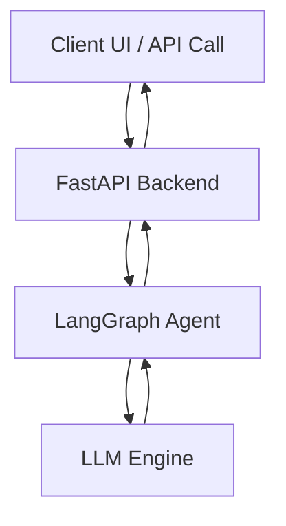

# AgentFabric Project 01  
# AutoAssist – Intelligent Vehicle Support Agent  
### By Babu Srinivasan  

---

# 🚗 AgentFabric AutoAssist

AutoAssist is a production-grade, single-agent AI system designed for automotive OEMs to provide intelligent, real-time vehicle support to customers and service teams.

This project demonstrates how to build a configurable, containerized, open-source LLM-powered assistant capable of running locally or deploying to cloud environments.

---

# 🎯 Business Problem

Automotive OEMs face recurring challenges:

- Customers struggle to interpret vehicle manuals.
- Service centers receive repetitive diagnostic queries.
- Knowledge is fragmented across PDFs, SOPs, and service bulletins.
- Support teams are overloaded with Tier-1 queries.

AutoAssist solves this by delivering a conversational AI layer capable of:

- Explaining vehicle features
- Providing troubleshooting guidance
- Offering maintenance recommendations
- Interpreting warning indicators
- Supporting multilingual extensibility

---

# 💡 Key Highlights

- Fully open-source LLM support (Mistral / Llama3 via LMStudio)
- Configurable LLM backend (local or API-based)
- FastAPI REST backend
- Structured system prompts for safety
- Dockerized and production-ready
- Logging & observability enabled
- Cloud-portable architecture
- Extensible to RAG in future phases

---

# 🧱 Tech Stack

- Python 3.10+
- FastAPI
- LangGraph (stateful agent orchestration)
- Open-source LLM (Mistral / Llama3)
- Docker & Docker Compose
- OpenTelemetry
- Prometheus (optional)
- Grafana (optional)

---

# 🏗 Solution Architecture



---

# ⚙️ Implementation Plan (8-Day Execution)

## Day 1 – Project Setup
- Initialize repository
- Setup virtual environment
- Configure local LLM via LMStudio
- Create environment-based config

## Day 2 – Agent Core
- Implement system prompt
- Build LangGraph single-node flow
- Add input/output validation

## Day 3 – FastAPI Integration
- Create `/chat` endpoint
- Add request schema validation
- Implement response formatting

## Day 4 – LLM Abstraction Layer
- Build configurable LLM adapter
- Add support for local and API modes
- Add timeout and retry handling

## Day 5 – Logging & Observability
- Add structured logging
- Integrate OpenTelemetry
- Add request tracing

## Day 6 – Dockerization
- Create Dockerfile
- Add docker-compose
- Add environment configs

## Day 7 – Testing & Hardening
- Add unit tests
- Add error handling
- Validate prompt safety constraints

## Day 8 – Documentation & Content
- Write README
- Create architecture diagram
- Record YouTube demo
- Publish LinkedIn deep dive

---

# 📂 Repository Structure

```
agentfabric-01-autoassist/
│
├── app/
│   ├── main.py
│   ├── agent.py
│   ├── llm_adapter.py
│   ├── config.py
│
├── tests/
├── docker-compose.yml
├── Dockerfile
├── .env.example
├── requirements.txt
└── README.md
```

---

# 🔐 Safety & Guardrails

- Domain-restricted system prompts
- No financial or medical advice responses
- Structured output enforcement
- Timeout and retry handling
- LLM abstraction layer for swap-in control

---

# 🚀 Deployment

## Local Run

```bash
uvicorn app.main:app --reload
```

## Docker

```bash
docker-compose up --build
```

---

# 📈 Observability (Optional)

To enable monitoring:

- Run Prometheus container
- Run Grafana container
- Enable OpenTelemetry exporter

---

# 🔄 Future Enhancements

- Add RAG using vehicle manuals
- Add VIN-based personalization
- Add multilingual support
- Add authentication layer
- Add analytics dashboard

---

# 🏁 Conclusion

AutoAssist demonstrates how to design and deploy a production-ready single-agent AI system using fully open-source components.

It establishes foundational capabilities for:

- Agent orchestration
- LLM abstraction
- Production deployment
- Observability integration
- Enterprise-ready design

This project marks the beginning of the AgentFabric journey — evolving from single-agent intelligence to distributed, enterprise-scale agentic platforms.

---

# 🔗 Part of AgentFabric by Babu Srinivasan
Architecting Distributed Agentic Intelligence
