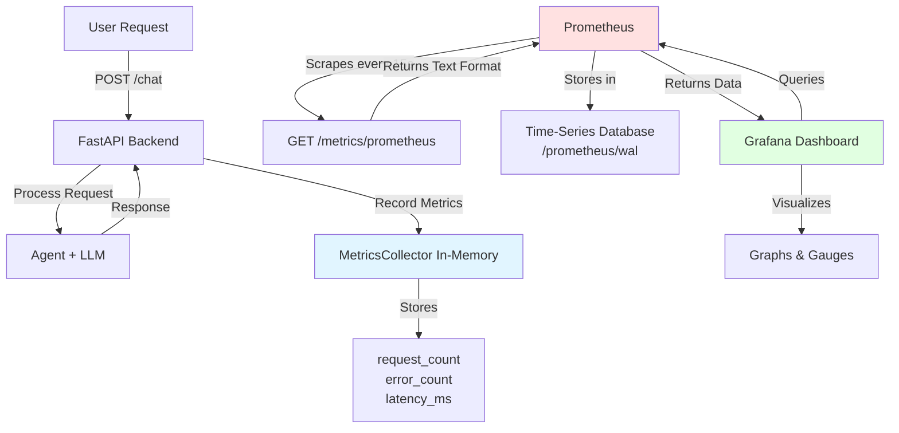

# AgentFabric Project 01  
# AutoAssist – Intelligent Vehicle Support Agent  
### By Babu Srinivasan  

---

# 🚗 AgentFabric AutoAssist

AutoAssist is a **production-grade, enterprise-ready** single-agent AI system designed for automotive OEMs to provide intelligent, real-time vehicle support to customers and service teams.

This project demonstrates how to build a configurable, containerized, open-source LLM-powered assistant capable of running locally or deploying to cloud environments.

## 🏢 Enterprise-Ready Features

Unlike simple chatbots, AutoAssist is built with enterprise production standards:

- **🛡️ Safety Guardrails**: Domain-restricted prompts prevent financial/medical advice, hallucinations controlled
- **📊 Full Observability**: Prometheus metrics + Grafana dashboards for real-time monitoring
- **📝 Structured Logging**: JSON-formatted logs with request tracking and latency metrics
- **🔄 Retry Logic**: Automatic retry with exponential backoff for LLM failures
- **⚡ Performance Monitoring**: Track request rates, error rates, latency, and success rates
- **🐳 Production Deployment**: Fully containerized with Docker Compose, health checks, and graceful shutdown
- **🔌 LLM Abstraction**: Swap between local models (LMStudio) and cloud APIs without code changes
- **⏱️ Timeout Handling**: Configurable timeouts (270s) for long-running LLM operations
- **🎯 Input Validation**: Request size limits, type checking, and sanitization
- **📈 Scalability Ready**: Stateless design, horizontal scaling capable

This is not just a demo—it's a foundation for enterprise AI deployments.

---

# 📋 Prerequisites

Before running AutoAssist, ensure you have the following installed:

## Required Software

| Software | Version | Purpose | Download Link |
|----------|---------|---------|---------------|
| **Docker** | 20.10+ | Container runtime | [Get Docker](https://docs.docker.com/get-docker/) |
| **Docker Compose** | 2.0+ | Multi-container orchestration | Included with Docker Desktop |
| **LMStudio** | Latest | Local LLM server | [lmstudio.ai](https://lmstudio.ai/) |
| **Python** | 3.10+ | Local development (optional) | [python.org](https://www.python.org/downloads/) |

## System Requirements

- **OS**: macOS, Linux, or Windows with WSL2
- **RAM**: 8GB minimum (16GB recommended for LLM)
- **Disk**: 10GB free space
- **CPU**: Multi-core processor recommended

## LMStudio Setup

1. Download and install LMStudio from [lmstudio.ai](https://lmstudio.ai/)
2. Download a model (recommended: Qwen, Mistral, or Llama3)
3. Start the local server:
   - Open LMStudio
   - Go to "Local Server" tab
   - Click "Start Server" (default port: 1234)
   - Enable API authentication and copy the API token
4. Configure to accept network connections:
   - In server settings, ensure it listens on `0.0.0.0` or allow network access
   - Note your API token for configuration

---

# 🚀 Quick Start Guide

## Step 1: Clone the Repository

```bash
git clone <repository-url>
cd AgentFabric-AutoAssist-Intelligent-Vehicle-Support-Agent
```

## Step 2: Configure Environment

```bash
# Copy the example environment file
cp .env.example .env

# Edit .env with your settings
nano .env  # or use your preferred editor
```

**Required Configuration:**

```bash
# LLM Configuration
MODEL_PROVIDER=local
MODEL_NAME=qwen3-esper3-reasoning-coder-instruct-6b-brainstorm20x-mlx-mlx  # Your model name
API_ENDPOINT=http://host.docker.internal:1234/v1
API_TOKEN=your-lmstudio-api-token-here
TIMEOUT_SECONDS=270

# Application Configuration
APP_NAME=AutoAssist
LOG_LEVEL=INFO
```

**Important Notes:**
- Use `host.docker.internal` for Docker to access LMStudio on your host machine
- Get your model name from LMStudio's "Local Server" tab
- Copy the API token from LMStudio's authentication settings

## Step 3: Start All Services

```bash
# Build and start all containers
docker-compose up --build

# Or run in detached mode (background)
docker-compose up -d
```

**Expected Output:**
```
✔ Container autoassist-prometheus   Started
✔ Container autoassist-api          Started
✔ Container autoassist-frontend     Started
✔ Container autoassist-grafana      Started
```

## Step 4: Verify Services are Running

```bash
# Check all containers are up
docker-compose ps

# Test backend health
curl http://localhost:8000/health

# Expected response:
# {"status":"healthy","service":"AutoAssist","version":"0.1.0"}
```

## Step 5: Access the Application

Open your browser and navigate to:

| Service | URL | Credentials |
|---------|-----|-------------|
| **Frontend UI** | http://localhost:3000 | None |
| **API Documentation** | http://localhost:8000/docs | None |
| **Prometheus** | http://localhost:9090 | None |
| **Grafana Dashboard** | http://localhost:3001 | admin / admin |

---

# ✅ Success Criteria

Your AutoAssist deployment is successful when:

## 1. All Services are Healthy

```bash
docker-compose ps
```
All containers should show status: `Up` and `(healthy)`

## 2. Backend Responds to Health Checks

```bash
curl http://localhost:8000/health
```
Returns: `{"status":"healthy","service":"AutoAssist","version":"0.1.0"}`

## 3. Chat Endpoint Works

```bash
curl -X POST http://localhost:8000/chat \
  -H "Content-Type: application/json" \
  -d '{"query": "What should I do if my check engine light is on?"}'
```

**Expected Response:**
```json
{
  "status": "success",
  "query": "What should I do if my check engine light is on?",
  "response": "If your check engine light comes on...",
  "model": "qwen3-esper3-reasoning-coder-instruct-6b-brainstorm20x-mlx-mlx"
}
```

## 4. Frontend UI is Accessible

- Navigate to http://localhost:3000
- You should see the AutoAssist chat interface
- Type a question and receive a response (may take 20-60 seconds)

## 5. Metrics are Being Collected

```bash
curl http://localhost:8000/metrics
```

**Expected Response:**
```json
{
  "total_requests": 1,
  "total_errors": 0,
  "avg_latency_ms": 25000.0,
  "success_rate": 100.0
}
```

## 6. Prometheus is Scraping

- Open http://localhost:9090
- Go to Status → Targets
- `autoassist` target should show state: **UP**

## 7. Grafana Dashboard Shows Data

- Open http://localhost:3001
- Login with admin/admin
- Navigate to Dashboards → AutoAssist Monitoring Dashboard
- You should see:
  - Total Requests counter
  - Success Rate gauge (should be 100%)
  - Latency graphs
  - Request rate over time

---

# 🧪 Testing the System

## Test Scenario 1: Basic Query

```bash
curl -X POST http://localhost:8000/chat \
  -H "Content-Type: application/json" \
  -d '{"query": "What is tire pressure?"}'
```

## Test Scenario 2: Complex Query

```bash
curl -X POST http://localhost:8000/chat \
  -H "Content-Type: application/json" \
  -d '{"query": "My car makes a squeaking noise when I brake. What could be wrong?"}'
```

## Test Scenario 3: Session Tracking

```bash
curl -X POST http://localhost:8000/chat \
  -H "Content-Type: application/json" \
  -d '{"query": "How often should I change my oil?", "session_id": "user-123"}'
```

## Test Scenario 4: Frontend UI

1. Open http://localhost:3000
2. Type: "What should I do if my battery warning light appears?"
3. Wait for response (20-60 seconds)
4. Verify you see a processing indicator
5. Verify response appears in chat

## Test Scenario 5: Metrics Validation

```bash
# Send multiple requests
for i in {1..5}; do
  curl -X POST http://localhost:8000/chat \
    -H "Content-Type: application/json" \
    -d "{\"query\": \"Test query $i\"}" &
done
wait

# Check metrics increased
curl http://localhost:8000/metrics
```

---

# 🛠️ Troubleshooting

## Issue: "Connection refused" when calling /chat

**Cause**: LMStudio is not running or not accessible from Docker

**Solution**:
1. Verify LMStudio server is running on port 1234
2. Check API token is correct in `.env`
3. Ensure `.env` uses `host.docker.internal` not `localhost`
4. Test connection: `curl http://localhost:1234/v1/models -H "Authorization: Bearer YOUR_TOKEN"`

## Issue: Requests timeout after 270 seconds

**Cause**: LLM model is too slow or overloaded

**Solution**:
1. Use a smaller/faster model in LMStudio
2. Reduce `MAX_TOKENS` in `.env` (try 512 instead of 1024)
3. Increase `TIMEOUT_SECONDS` in `.env` if needed

## Issue: Grafana dashboard is empty

**Cause**: No requests have been processed yet

**Solution**:
1. Send a few test requests to `/chat`
2. Wait 15 seconds for Prometheus to scrape
3. Refresh Grafana dashboard

## Issue: Docker containers won't start

**Cause**: Port conflicts or insufficient resources

**Solution**:
```bash
# Check what's using the ports
lsof -i :8000  # Backend
lsof -i :3000  # Frontend
lsof -i :9090  # Prometheus
lsof -i :3001  # Grafana

# Stop conflicting services or change ports in docker-compose.yml
```

## Issue: "Dashboard title cannot be empty" in Grafana logs

**Cause**: Dashboard provisioning failed

**Solution**:
```bash
# Recreate Grafana container
docker-compose stop grafana
docker-compose rm -f grafana
docker-compose up -d grafana
```

---

# 🎯 Business Problem

Automotive OEMs face recurring challenges:

- Customers struggle to interpret vehicle manuals.
- Service centers receive repetitive diagnostic queries.
- Knowledge is fragmented across PDFs, SOPs, and service bulletins.
- Support teams are overloaded with Tier-1 queries.

AutoAssist solves this by delivering a conversational AI layer capable of:

- Explaining vehicle features
- Providing troubleshooting guidance
- Offering maintenance recommendations
- Interpreting warning indicators
- Supporting multilingual extensibility

---

# 💡 Key Highlights

- Fully open-source LLM support (Mistral / Llama3 via LMStudio)
- Configurable LLM backend (local or API-based)
- FastAPI REST backend
- Structured system prompts for safety
- Dockerized and production-ready
- Logging & observability enabled
- Cloud-portable architecture
- Extensible to RAG in future phases

---

# 🧱 Tech Stack

- Python 3.10+
- FastAPI
- LangGraph (stateful agent orchestration)
- Open-source LLM (Mistral / Llama3)
- Docker & Docker Compose
- OpenTelemetry
- Prometheus (optional)
- Grafana (optional)

---

# 🏗 Solution Architecture


---

# 📊 Observability & Metrics Flow

## Complete Metrics Pipeline



## Metrics Flow Steps

**Step 1: Backend Generates Metrics**
- Each request is processed by `app/main.py`
- Metrics recorded via `metrics.record_request(latency_ms, error)`
- Stored in-memory by `MetricsCollector` class in `app/observability.py`

**Step 2: Metrics Exposed via HTTP**
- Endpoint: `GET /metrics/prometheus`
- Returns Prometheus text format:
  ```
  autoassist_requests_total 4
  autoassist_errors_total 0
  autoassist_request_latency_ms 38039.67
  autoassist_success_rate 100.0
  ```

**Step 3: Prometheus Scrapes Metrics**
- Configured in `observability/prometheus.yml`
- Scrapes `http://autoassist-api:8000/metrics/prometheus` every 15 seconds
- Stores data in time-series database at `/prometheus/`

**Step 4: Grafana Queries Prometheus**
- Datasource configured: `http://prometheus:9090`
- Dashboard panels query metrics like `autoassist_requests_total`
- Visualizes as graphs, gauges, and stats
- Auto-refreshes every 5 seconds

## Available Metrics

| Metric | Type | Description |
|--------|------|-------------|
| `autoassist_requests_total` | Counter | Total number of chat requests processed |
| `autoassist_errors_total` | Counter | Total number of failed requests |
| `autoassist_request_latency_ms` | Gauge | Average response latency in milliseconds |
| `autoassist_success_rate` | Gauge | Success rate percentage (0-100) |

## Access Points

- **Backend API**: http://localhost:8000
- **Metrics (JSON)**: http://localhost:8000/metrics
- **Metrics (Prometheus)**: http://localhost:8000/metrics/prometheus
- **Prometheus UI**: http://localhost:9090
- **Grafana Dashboard**: http://localhost:3001 (admin/admin)
- **Frontend UI**: http://localhost:3000

---

# ⚙️ Implementation Plan (8-Day Execution)

## Day 1 – Project Setup
- Initialize repository
- Setup virtual environment
- Configure local LLM via LMStudio
- Create environment-based config

## Day 2 – Agent Core
- Implement system prompt
- Build LangGraph single-node flow
- Add input/output validation

## Day 3 – FastAPI Integration
- Create `/chat` endpoint
- Add request schema validation
- Implement response formatting

## Day 4 – LLM Abstraction Layer
- Build configurable LLM adapter
- Add support for local and API modes
- Add timeout and retry handling

## Day 5 – Logging & Observability
- Add structured logging
- Integrate OpenTelemetry
- Add request tracing

## Day 6 – Dockerization
- Create Dockerfile
- Add docker-compose
- Add environment configs

## Day 7 – Testing & Hardening
- Add unit tests
- Add error handling
- Validate prompt safety constraints

## Day 8 – Documentation & Content
- Write README
- Create architecture diagram
- Record YouTube demo
- Publish LinkedIn deep dive

---

# 📂 Repository Structure

```
agentfabric-01-autoassist/
│
├── app/
│   ├── main.py
│   ├── agent.py
│   ├── llm_adapter.py
│   ├── config.py
│
├── tests/
├── docker-compose.yml
├── Dockerfile
├── .env.example
├── requirements.txt
└── README.md
```

---

# 🔐 Safety & Guardrails

- Domain-restricted system prompts
- No financial or medical advice responses
- Structured output enforcement
- Timeout and retry handling
- LLM abstraction layer for swap-in control

---

# 🚀 Deployment

## Local Run

```bash
uvicorn app.main:app --reload
```

## Docker

```bash
docker-compose up --build
```

---

# 📈 Observability

AutoAssist includes a complete observability stack with Prometheus and Grafana for monitoring system health and performance.

## Quick Start

1. **Start all services:**
   ```bash
   docker-compose up --build
   ```

2. **Access Grafana Dashboard:**
   - URL: http://localhost:3001
   - Login: admin / admin
   - Dashboard: "AutoAssist Monitoring Dashboard"

3. **Access Prometheus:**
   - URL: http://localhost:9090
   - Try queries like: `autoassist_requests_total`

## What You Can Monitor

- **Total Requests**: Track usage and load
- **Error Rate**: Identify failures and issues
- **Response Latency**: Monitor LLM performance (typically 20-60 seconds)
- **Success Rate**: Overall system health (should be >95%)
- **Request Rate**: Requests per minute over time

## Useful Prometheus Queries

```promql
# Total requests
autoassist_requests_total

# Request rate (per minute)
rate(autoassist_requests_total[5m]) * 60

# Error rate
rate(autoassist_errors_total[5m])

# Average latency
autoassist_request_latency_ms

# Success rate
autoassist_success_rate
```

## Troubleshooting

**Dashboard not showing data?**
- Send a few test requests to `/chat` endpoint
- Wait 15 seconds for Prometheus to scrape
- Refresh Grafana dashboard

**Prometheus not scraping?**
- Check targets: http://localhost:9090/targets
- Verify `autoassist` target shows "UP"
- Check backend is running: `curl http://localhost:8000/health`

---

# 🔄 Future Enhancements

- Add RAG using vehicle manuals
- Add VIN-based personalization
- Add multilingual support
- Add authentication layer
- Add analytics dashboard

---

# 🏁 Conclusion

AutoAssist demonstrates how to design and deploy a production-ready single-agent AI system using fully open-source components.

It establishes foundational capabilities for:

- Agent orchestration
- LLM abstraction
- Production deployment
- Observability integration
- Enterprise-ready design

This project marks the beginning of the AgentFabric journey — evolving from single-agent intelligence to distributed, enterprise-scale agentic platforms.

---

# 🔗 Part of AgentFabric by Babu Srinivasan
Architecting Distributed Agentic Intelligence
