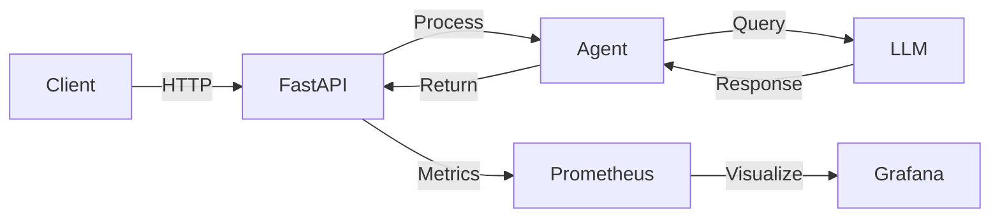
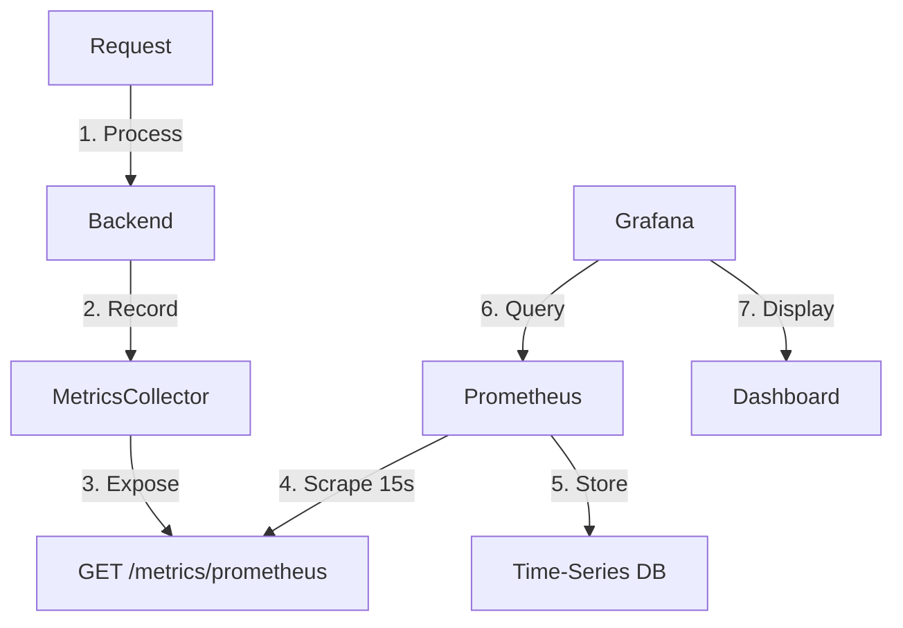

# AutoAssist – Production-Grade AI Vehicle Support Agent
### AgentFabric Project 01 | By Babu Srinivasan

<div align="center">

[](https://www.python.org/downloads/)
[](https://fastapi.tiangolo.com/)
[](https://www.docker.com/)
[](#-security--hardening)
[](LICENSE)

**Enterprise-ready LLM-powered assistant with full observability, safety guardrails, and production deployment**

[Quick Start](#-quick-start) • [Security](#-security--hardening) • [Architecture](#-architecture) • [API Docs](#-api-reference) • [Monitoring](#-observability)

</div>

---

## 🎯 What Makes This Enterprise-Ready?

AutoAssist isn't just another chatbot demo. It's a **production-grade AI system** built with enterprise standards:

| Feature | Implementation | Why It Matters |
|---------|---------------|----------------|
| **Safety Guardrails** | Domain-restricted prompts, input validation | Prevents hallucinations, inappropriate responses |
| **Full Observability** | Prometheus + Grafana + structured logging | Real-time monitoring, debugging, alerting |
| **Retry Logic** | 3 attempts with exponential backoff | Handles transient LLM failures gracefully |
| **LLM Abstraction** | Pluggable adapter pattern | Swap models without code changes |
| **Timeout Handling** | Configurable 270s timeout | Prevents hanging requests |
| **Health Checks** | Kubernetes-ready endpoints | Container orchestration support |
| **Stateless Design** | No session persistence | Horizontal scaling ready |
| **Structured Logging** | JSON format with request IDs | Centralized log aggregation ready |

**Perfect for:** Learning production AI patterns, building POCs, or deploying to production with minimal changes.

---

## 🔒 Security & Hardening

AutoAssist implements multiple layers of security for production deployment:

### Input Security
- **Strict Input Validation**: Regex patterns for query and session_id fields
- **Length Limits**: Max 1000 chars for queries, 100 for session IDs
- **Input Sanitization**: Automatic trimming and cleaning of user input
- **Injection Prevention**: Alphanumeric + basic punctuation only

### API Security
- **CORS Restrictions**: Whitelist-only origins (no wildcards in production)
- **Method Restrictions**: Only GET and POST allowed
- **Header Restrictions**: Limited to Content-Type and Authorization
- **Error Sanitization**: Generic error messages (no internal details exposed)

### Container Security
- **Non-Root User**: Application runs as `appuser` (not root)
- **Minimal Image**: Slim base image with cleaned package cache
- **Read-Only Filesystem**: Application code owned by non-root user
- **Health Checks**: Automated container health monitoring

### Secrets Management
- **Environment Variables**: All secrets loaded from .env (never hardcoded)
- **Git Protection**: .env excluded from version control
- **Token Rotation**: API tokens configurable without code changes
- **Grafana Security**: Password from environment, secure cookies, CSRF protection

### Monitoring & Audit
- **Structured Logging**: JSON format with request IDs for audit trails
- **Metrics Collection**: Track errors, latency, success rates
- **Request Tracking**: Full request lifecycle logging
- **Exception Logging**: Detailed server-side error logs (not exposed to clients)

### Production Recommendations
```bash
# Set strong Grafana password
GRAFANA_ADMIN_PASSWORD=your-strong-password

# Disable debug mode
DEBUG=false

# Use INFO or WARNING log level
LOG_LEVEL=INFO

# Add rate limiting (future enhancement)
# Add authentication layer (JWT/OAuth)
# Enable HTTPS/TLS
# Implement API key validation
```

---

## 🚀 Quick Start

### Prerequisites

```bash
# Required
- Docker 20.10+ & Docker Compose 2.0+
- LMStudio (for local LLM)

# Optional
- Python 3.10+ (for local development)
```

### 3-Minute Setup

```bash
# 1. Clone and navigate
git clone <repo-url>
cd AgentFabric-AutoAssist-Intelligent-Vehicle-Support-Agent

# 2. Configure environment
cp .env.example .env
# Edit .env: Set MODEL_NAME, API_TOKEN from LMStudio

# 3. Start everything
docker-compose up -d

# 4. Verify
curl http://localhost:8000/health
```

**Access Points:**
- Frontend: http://localhost:3000
- API Docs: http://localhost:8000/docs
- Grafana: http://localhost:3001 (admin/admin)
- Prometheus: http://localhost:9090

---

## 🏗 Architecture

### System Overview



### Metrics Pipeline



### Tech Stack

| Layer | Technology | Purpose |
|-------|-----------|---------|
| **API** | FastAPI | High-performance async REST API |
| **Agent** | Custom Python | LLM orchestration & prompt management |
| **LLM** | LMStudio (local) | Open-source model inference |
| **Monitoring** | Prometheus + Grafana | Metrics collection & visualization |
| **Logging** | Python logging | Structured JSON logs |
| **Container** | Docker Compose | Multi-service orchestration |

---

## 📂 Project Structure

```
AgentFabric-AutoAssist-Intelligent-Vehicle-Support-Agent/
├── app/
│   ├── main.py              # FastAPI app & endpoints
│   ├── agent.py             # Agent logic & prompts
│   ├── llm_adapter.py       # LLM abstraction layer
│   ├── config.py            # Environment configuration
│   └── observability.py     # Metrics & logging
├── frontend/
│   ├── index.html           # Chat UI
│   ├── js/app.js            # Frontend logic
│   └── css/styles.css       # Styling
├── observability/
│   ├── prometheus.yml       # Prometheus config
│   └── grafana/             # Grafana dashboards
├── docker-compose.yml       # Service orchestration
├── Dockerfile               # Backend container
├── .env.example             # Configuration template
└── requirements.txt         # Python dependencies
```

---

## 🔧 Configuration

### Environment Variables

```bash
# LLM Configuration
MODEL_PROVIDER=local                    # local or api
MODEL_NAME=qwen3-esper3-reasoning...    # Your model from LMStudio
API_ENDPOINT=http://host.docker.internal:1234/v1
API_TOKEN=sk-lm-xxxxx                   # From LMStudio auth
TIMEOUT_SECONDS=270                     # 4.5 minutes
MAX_TOKENS=1024                         # Response length
TEMPERATURE=0.7                         # Randomness (0-1)

# Application
APP_NAME=AutoAssist
LOG_LEVEL=INFO                          # DEBUG, INFO, WARNING, ERROR
DEBUG=false
```

### LMStudio Setup

1. Download from [lmstudio.ai](https://lmstudio.ai/)
2. Load a model (Qwen, Mistral, Llama3)
3. Start server (port 1234)
4. Enable auth & copy token
5. Ensure network access enabled

---

## 📡 API Reference

### Endpoints

#### `POST /chat`
Process a vehicle support query.

**Request:**
```json
{
  "query": "What should I do if my check engine light is on?",
  "session_id": "user-123"  // optional
}
```

**Response:**
```json
{
  "status": "success",
  "query": "What should I do if my check engine light is on?",
  "response": "If your check engine light comes on...",
  "model": "qwen3-esper3-reasoning-coder-instruct-6b-brainstorm20x-mlx-mlx"
}
```

#### `GET /health`
Health check endpoint.

**Response:**
```json
{
  "status": "healthy",
  "service": "AutoAssist",
  "version": "0.1.0"
}
```

#### `GET /metrics`
JSON-formatted metrics.

**Response:**
```json
{
  "total_requests": 42,
  "total_errors": 0,
  "avg_latency_ms": 25000.0,
  "success_rate": 100.0
}
```

#### `GET /metrics/prometheus`
Prometheus text format metrics.

---

## 📊 Observability

### Available Metrics

| Metric | Type | Description |
|--------|------|-------------|
| `autoassist_requests_total` | Counter | Total requests processed |
| `autoassist_errors_total` | Counter | Total failed requests |
| `autoassist_request_latency_ms` | Gauge | Average response time |
| `autoassist_success_rate` | Gauge | Success percentage (0-100) |

### Prometheus Queries

```promql
# Request rate (per minute)
rate(autoassist_requests_total[5m]) * 60

# Error rate
rate(autoassist_errors_total[5m])

# 95th percentile latency (if histogram available)
histogram_quantile(0.95, autoassist_request_duration_seconds_bucket)
```

### Grafana Dashboard

Pre-configured dashboard includes:
- Total requests counter
- Success rate gauge (green >95%, yellow >80%, red <80%)
- Average latency stat
- Request rate graph
- Latency over time graph

**Access:** http://localhost:3001 → Dashboards → AutoAssist Monitoring Dashboard

---

## 🧪 Testing

### Quick Tests

```bash
# Health check
curl http://localhost:8000/health

# Simple query
curl -X POST http://localhost:8000/chat \
  -H "Content-Type: application/json" \
  -d '{"query": "What is tire pressure?"}'

# Check metrics
curl http://localhost:8000/metrics

# Load test (5 concurrent requests)
for i in {1..5}; do
  curl -X POST http://localhost:8000/chat \
    -H "Content-Type: application/json" \
    -d "{\"query\": \"Test $i\"}" &
done
wait
```

### Expected Behavior

- **Response Time:** 20-60 seconds (depends on model)
- **Success Rate:** >95% under normal conditions
- **Error Handling:** Automatic retry on transient failures
- **Timeout:** 270 seconds before giving up

---

## 🛠️ Development

### Local Development (No Docker)

```bash
# Setup
python3 -m venv venv
source venv/bin/activate
pip install -r requirements.txt

# Configure
cp .env.example .env
# Edit .env with localhost:1234 for LMStudio

# Run
uvicorn app.main:app --reload --host 0.0.0.0 --port 8000
```

### Adding New Features

**1. Add a new metric:**
```python
# app/observability.py
class MetricsCollector:
    def __init__(self):
        self.custom_metric = 0
    
    def record_custom(self, value):
        self.custom_metric += value
```

**2. Modify system prompt:**
```python
# app/agent.py
SYSTEM_PROMPT = """Your custom prompt here..."""
```

**3. Add new endpoint:**
```python
# app/main.py
@app.get("/custom")
async def custom_endpoint():
    return {"message": "Custom response"}
```

---

## 🐛 Troubleshooting

### Common Issues

| Issue | Cause | Solution |
|-------|-------|----------|
| Connection refused | LMStudio not running | Start LMStudio server on port 1234 |
| Timeout after 270s | Model too slow | Use smaller model or increase timeout |
| Empty Grafana dashboard | No requests yet | Send test requests, wait 15s |
| Port conflicts | Services already running | Check `lsof -i :8000` and stop conflicts |
| Auth errors | Wrong API token | Copy token from LMStudio settings |

### Debug Mode

```bash
# Enable debug logging
echo "LOG_LEVEL=DEBUG" >> .env
docker-compose restart autoassist

# View logs
docker-compose logs -f autoassist

# Check Prometheus targets
curl http://localhost:9090/api/v1/targets | jq
```

---

## 🚢 Production Deployment

### Checklist

- [ ] Change Grafana admin password
- [ ] Set `DEBUG=false` in production
- [ ] Configure proper `API_TOKEN` rotation
- [ ] Set up external Prometheus/Grafana
- [ ] Enable HTTPS/TLS
- [ ] Add rate limiting
- [ ] Configure log aggregation (ELK, Datadog)
- [ ] Set up alerting rules
- [ ] Implement authentication
- [ ] Add request ID propagation

### Scaling Considerations

- **Horizontal Scaling:** Stateless design allows multiple replicas
- **Load Balancing:** Use nginx/HAProxy in front of API
- **Database:** Add Redis for session management if needed
- **LLM:** Consider cloud LLM APIs for production scale

---

## 🎓 Learning Resources

### Key Concepts Demonstrated

1. **LLM Abstraction Pattern** - Swap models without code changes
2. **Observability First** - Metrics before features
3. **Retry Logic** - Handle transient failures gracefully
4. **Health Checks** - Kubernetes-ready endpoints
5. **Structured Logging** - JSON for log aggregation
6. **Configuration Management** - Environment-based config
7. **Container Orchestration** - Multi-service Docker Compose

### Next Steps

- Add RAG with vector database (Pinecone, Weaviate)
- Implement authentication (JWT, OAuth)
- Add rate limiting (Redis-based)
- Set up CI/CD pipeline
- Add unit/integration tests
- Implement caching layer
- Add multi-language support

---

## 📄 License

MIT License - See [LICENSE](LICENSE) file

---

## 🤝 Contributing

Contributions welcome! Please:
1. Fork the repository
2. Create a feature branch
3. Make your changes
4. Add tests if applicable
5. Submit a pull request

---

## 📞 Support

- **Issues:** [GitHub Issues](https://github.com/your-repo/issues)
- **Discussions:** [GitHub Discussions](https://github.com/your-repo/discussions)
- **Author:** Babu Srinivasan

---

<div align="center">

**Part of AgentFabric Series**  
*Architecting Distributed Agentic Intelligence*

[⭐ Star this repo](https://github.com/your-repo) if you find it useful!

</div>
